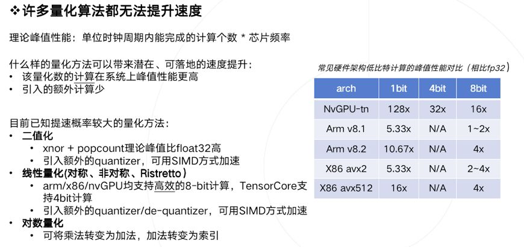
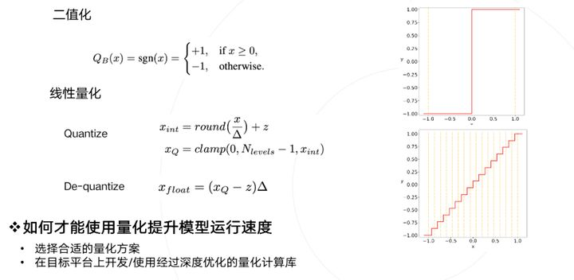
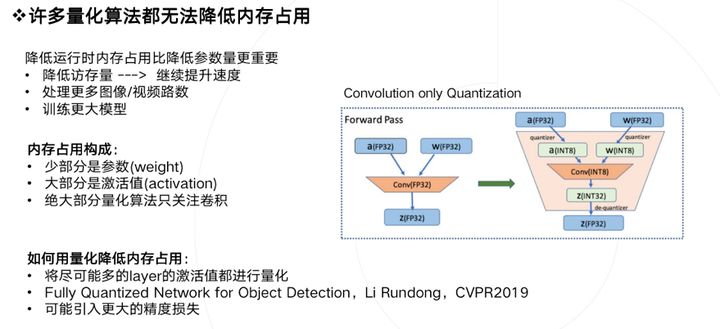
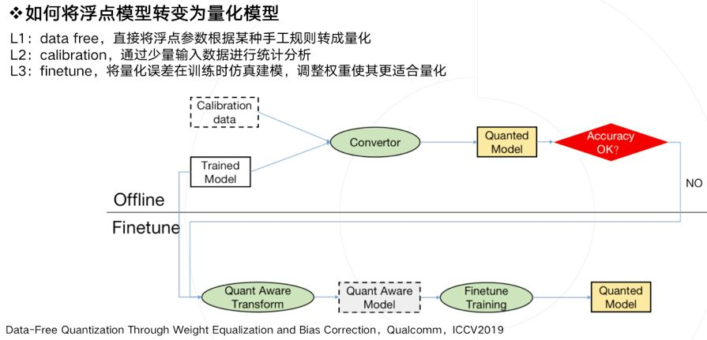
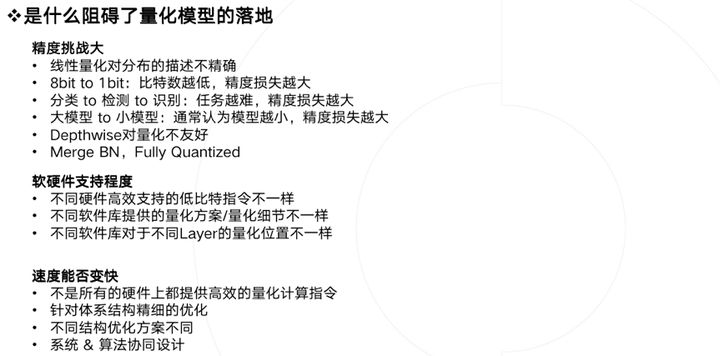

# Deploy

深度学习的上半场主题是**自证**, 数据科学家们设计出各种各样的模型结构(topology architecture), 并用海量的数据喂养它, 最终养成能够解决各行各业不同问题的高指标模型。经过这一阶段，基本证明了深度学习作为一种新的方法，能够解决一些实际场景之前难解或不可解的问题。基于此，上半场的主要工作在**训练**模型。
随着上半场的推进，目前整个社会对深度学习确实是很多问题的有效解决方案已没有异议。那么，势必推进到下半场，下半场的主题是**落地**，也就是把训练出的模型部署到实际的应用场景中，产生经济或社会效益。所以，下半场的主要工作在**推理**阶段。

#### 模型优化/Model Optimization

+ ##### 网络结构搜索/NAS

+ ##### Graph优化

  + 图优化主要通过子图变换和算子融合的方式来达到减少计算量或者其他系统开销（如访存开销），从而达到性能优化的目的。图优化主要是希望在不影响模型的数值特性的基础上，通过图变换达到简化计算、资源开销，提升性能，所以是性能优化时的首选方法之一

  + Operator和Tensor的融合操作/TensorRT, 比如Conv + BN融合， Bias + ReLU融合， 能够减少从低层memory向高层memory的搬运， 否则需要数据从cache移到register，在移回cache，搬运数据的指令和延迟都是可以节约的开销
  + 通过合理选择op执行顺序，可以尽量避免pooling和depthwise conv之间对主存的访问，降低内存带宽压力
  + 对于Operator粒度来说，并不是说粒度粗就一定好，或者粒度细就一定好，也是从计算量和访存量两个角度，同时在影响深度学习的性能

+ ##### 算子优化

  + 算法优化。对同一个算子可能有不同的算法去实现它。举个例子，对卷积算法我们常见的就有：矩阵乘法，直接卷积法，Winograd变换法，FFT变换法。需要我们针对目标问题，分析并实现合适的算法，来达到最佳性能
  + 微架构优化。微架构优化主要焦点是如何充分利用好微架构的内置加速器的能力去最大化算子的性能。如Intel Xeon CPU 里面一般都有SIMD(Single Instruction Multiple Data)加速器(如AVX-512的FMA(Fused Multiply-Add)加速)。如何充分利用并最大化这些SIMD加速器的利用率，是微架构优化需要做的
  + 计算密集型算子， 卷积，全连接；访存密集型算子，ReLU， element-wise sum，在典型的深度学习模型中，一般计算密集型和访存密集型算子是相伴出现的，最简单的例子是”Conv + ReLU“相伴出现。这时候我们可以通过fusion来实现“in register computing”，从而减少访存密集型算子的访存，减少内存访问延时和带宽压力，提高推理效率 
  + memory layout propagation。针对不同特点的计算平台和不同的算子，为了追求最好的性能匹配，一般都需要选择不同的tensor内存布局(memory layout)，而这些layout可能跟框架缺省的内存布局是不一样的

+ 

#### 模型压缩/Model Compression

+ ##### 剪枝/Prune

  + 结构化剪枝&非结构化剪枝, 其中非结构化剪枝一般很难实现底层加速
  + 模型剪枝逐渐被网络结构搜索取代
  + 稀疏化，工程实现较难，需要fine tune，不易于解耦模型研究和部署加速，另外稀疏矩阵运算的实际效率往往也不高
  + 通过结构化稀疏，通过一些方式保证稀疏矩阵中0以一定的规律出现，例如同一列、同一行、某些块等，尽量提高稀疏矩阵运算的效果
  + 稀疏化是韩松在FPGA提出，稀疏化相当于减少了电路，但是对于通用计算平台CPU&GPU，不规则稀疏矩阵计算最终还是要落地到规则的计算单元上，这个时候是性能变好还是变差取决于problem size和如何把问题映射到计算单元上的方案，性能是提高还是降低是不确定的

+ ##### 量化/Quantization

  

  

  

  

  

  + 模型量化主要是通过降低模型中tensor和weights精度的手段，从而减少计算需求和数据存储与传输需求，来达到加速的目的。主要方法分两派：一是训练后量化(Post-training Quantization)，二是量化感知训练(Quantization-Aware Training)
  + 由于模型量化是一种近似算法方法，精度损失是一个严峻的问题，关注精度的同时，注重部署最终的速度和资源占用情况
  + 量化是否一定能加速计算？回答是否定的，许多量化算法都无法带来实质性加速， 保证实现的低比特计算效率超过原先浮点计算，否则为何要承担精度损失的风险而使用并不加速的量化模型呢
  + 

+ ##### 蒸馏/Distillation

  + teacher - 原始模型或模型ensemble
  + student - 新模型
  + transfer set - 用来迁移teacher知识、训练student的数据集合
  + soft target - teacher输出的预测结果（一般是softmax之后的概率）
  + hard target - 样本原本的标签
  + temperature - 蒸馏目标函数中的超参数
  + born-again network - 蒸馏的一种，指student和teacher的结构和尺寸完全一样
  + teacher annealing - 防止student的表现被teacher限制，在蒸馏时逐渐减少soft targets的权重
  + 模型蒸馏采用的是迁移学习的方法，通过采用预先训练好的复杂模型(Teacher Model)的输出作为监督信号去训练另外一个简单的网络(Student Model)，最后把Student Model用于推理

  + 大模型作为Teacher模型, 设计对应的小模型, 通过soft-target引导Student模型训练, 实现Teacher模型的知识迁移
  + 类似迁移学习的手段，一般用于分类模型，才有soft-target存在
  + **好模型的目标不是拟合训练数据，而是学习如何泛化到新的数据。**所以蒸馏的目标是让student学习到teacher的泛化能力，理论上得到的结果会比单纯拟合训练数据的student要好。另外，对于分类任务，如果soft targets的熵比hard targets高，那显然student会学习到更多的信息
  + 蒸馏时softmax比之前多参数T，Temperature， T越大，概率分布越平滑
  + soft target能够起到正则的作用，稳定收敛
  + 数据过少的话无法完整表达teacher学到的知识，需要增加无监督数据（用teacher的预测作为标签）或进行数据增强
  + **student学习的是teacher的泛化能力，而不是“过拟合训练数据”**

#### 推理机/Inference Engine

+ ##### Roofline Model

  + 计算资源&带宽资源/FLOPS&byte/s
  + 计算密度/FLOPS/byte
  + 计算密度小于一定值，受带宽资源限制；计算密度大于一定值，受计算资源限制
  + 拐点很重要，与硬件相关，表征硬件理论计算能力和内存带宽之间的比值
  + 大矩阵x大矩阵受计算资源约束， 大矩阵x向量受带宽资源约束
  + 寄存器、缓存、主存
  + 计算访存量的规则是：对每一个Operator或者是layer，计算所有输入的Tensor、所有参数的Tensor，还有输出Tensor的总大小作为访存量
  + 小模型访存量并没有显著减小，计算密度显著减小，小模型通常被存储带宽限制，而并非是计算量
  + Bottleneck，Depthwise，大幅减少计算量，访存量小幅上升，计算密度大幅下降
  + 

+ ##### SIMD

  + Single Instruction Multiple Data
  +  

+ ##### AVX/AVX512

  + Advanced Vector Entexsions, 高级向量扩展指令集, 英特尔&AMD支持

  + AVX512寄存器宽度从256增加到512位, 寄存器数量增加一倍达到32
  + AVX512提升8倍性能, 并行处理16条消息
  + AVX512并行进行SHA256计算,  write64字节倍数的消息, 总长度尽量保持相似

+ ##### 访存/Memory Access

  + Tensorflow Lite在设计时， channel为8的倍数会有更好的效果

+ ##### ONNXRuntime

+ ##### Tensorflow Lite

+ ##### NCNN

+ ##### TVM

+ ##### MNN

